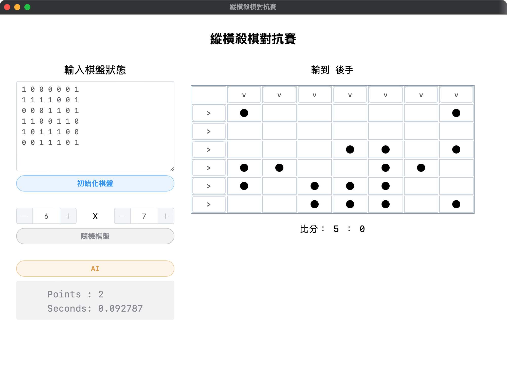
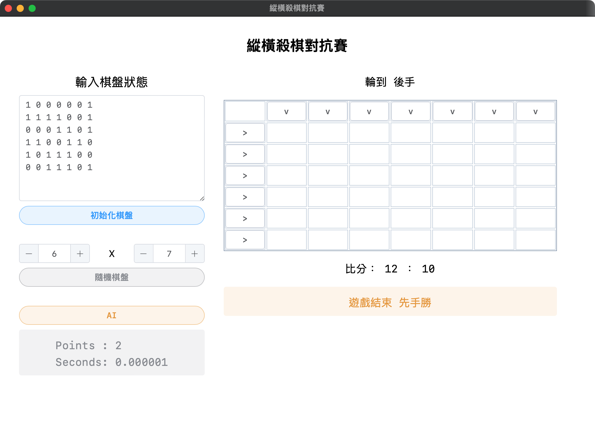

# 縱橫殺棋對抗賽
- 這是 NTNU CSIE AI 課程的 HW03，一個名為 **縱橫殺棋** 的遊戲。
- 並且透過 **Alpha-Beta Pruning** 演算法來實作 AI。

## 遊戲規則
- 玩家每次可以選擇至少有一顆棋子的縱向或橫向的任一行或任一列，將此行或此列的所有棋子移除。
- 當所有的棋子都被移除時，則遊戲結束。
- 哪一方取得較多的棋子，則為勝利。

---

